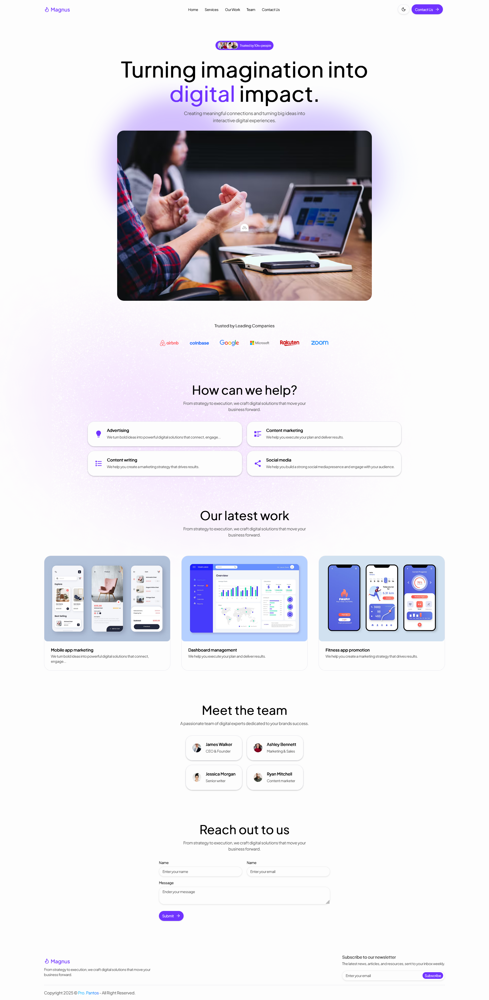

# Universidad - Portal Web Moderno

Un portal web moderno y responsivo para la gestión de contenidos universitarios, construido con Nuxt.js, Vue.js, Tailwind CSS y Shadcn Vue UI.

## Demo

[Demo en Vivo](https://universidad-demo.vercel.app)

## Vista Previa



## Características

- Diseño moderno y limpio
- Diseño completamente responsivo
- Construido con Nuxt.js y Vue.js
- Estilizado con Tailwind CSS v4
- Componentes de [Shadcn Vue UI](https://www.shadcn-vue.com)
- Soporte para modo oscuro
- Portal de estudiantes y docentes

## Inicio Rápido

1. Clonar el repositorio:

```bash
git clone https://github.com/AldahirG/universidad.git
cd universidad
```

2. Instalar dependencias:

```bash
bun i
```

3. Iniciar el servidor de desarrollo:

```bash
bun dev
```

4. Abre [http://localhost:3000](http://localhost:3000) en tu navegador.

## Contribuir

Si tienes sugerencias o mejoras, crea un issue o envía un pull request.

## Licencia
MIT